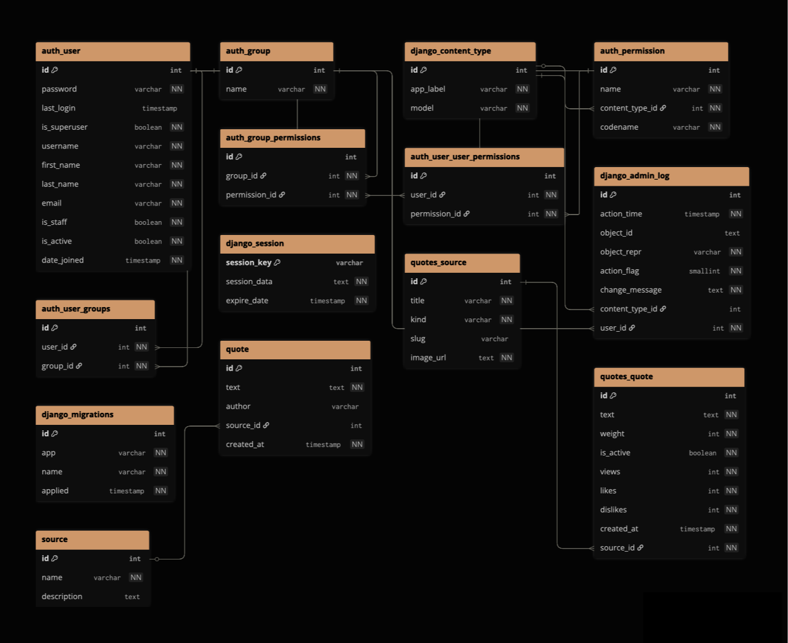
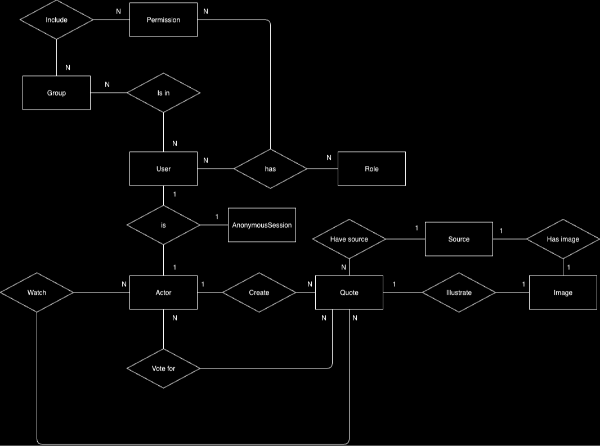
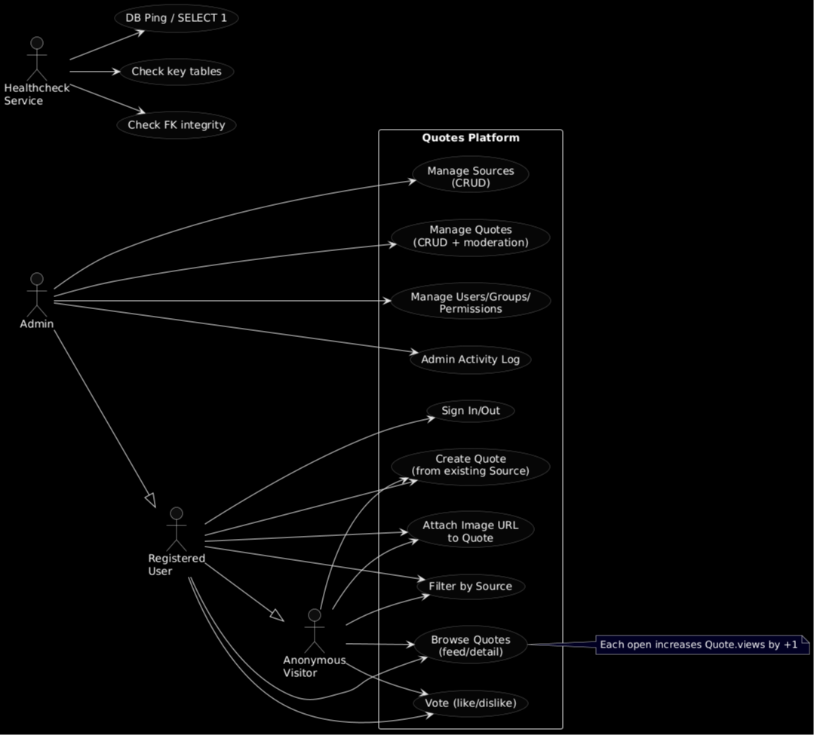
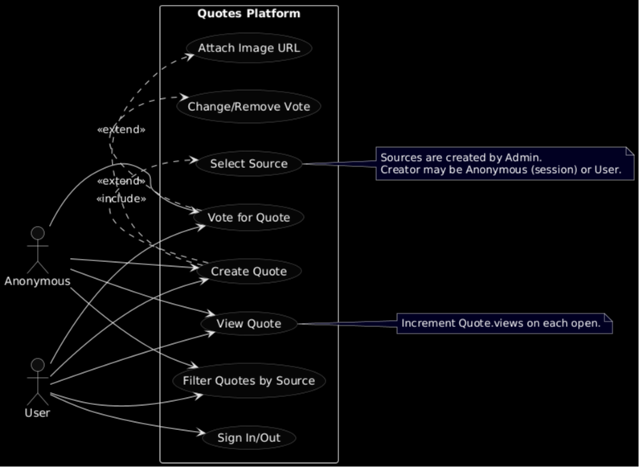

# Сборник цитат

Веб-приложение на Django для хранения, отображения и управления цитатами из фильмов, книг и других источников.
[**Просмотрите цитаты** или *добавьте свои* в Quotes](https://quotes-web-app-hslc.onrender.com)

### Основной функционал
- **Случайные цитаты** - показ случайной цитаты с учетом веса
- **Топ-10 цитат** - рейтинг по лайкам и просмотрам
- **Поиск по источнику** - поиск цитат по названию фильма/книги
- **Добавление цитат** - создание новых цитат и источников
- **Система лайков** - голосование за цитаты
- **API** - REST API для получения случайных цитат

### Аналитика (Схема БД, ER-диаграмма, use-cases)
<figure>
  
  <figcaption>Рис.1 Схема базы данных</figcaption>
</figure>

<figure>
  
  <figcaption>Рис.2 Диаграмма Отношений Сущностей (ER)</figcaption>
</figure>

<figure>
  
  <figcaption>Рис.3 Use-case (уровень 0)</figcaption>
</figure>

<figure>
  
  <figcaption>Рис.4 Use-case (уровень 1)</figcaption>
</figure>

### Математическое описание

Модель данных  
  - Множества и элементы:
    - S = {s₁, s₂, ..., sₙ} - множество источников (Source)
    - Q = {q₁, q₂, ..., qₘ} - множество цитат (Quote)
    - T = {'movie', 'book', 'other'} - множество типов источников

  - Отношения:
    - R ⊆ Q × S - отношение "цитата принадлежит источнику" (ForeignKey)
    - |R(q)| = 1 ∀q ∈ Q (каждая цитата имеет ровно один источник)

  - Ограничения:
    - Уникальность: ∀s₁, s₂ ∈ S: s₁.title ≠ s₂.title
    - Активные цитаты: ∀s ∈ S: |{q ∈ Q | R(q) = s ∧ q.is_active = True}| ≤ 3
    - Вес: ∀q ∈ Q: q.weight ≥ 1

  - Алгоритм взвешенного выбора (Weighted Choice)
    - Математическая модель:
      - Пусть W = {w₁, w₂, ..., wₘ} - множество весов цитат

    - Функция вероятности выбора:
      - P(qᵢ) = wᵢ / Σⱼ₌₁ᵐ wⱼ

      - где:
      - P(qᵢ) - вероятность выбора цитаты qᵢ
      - wᵢ - вес цитаты qᵢ
      - Σⱼ₌₁ᵐ wⱼ - сумма всех весов

  - Модель взаимодействия:
    - Views: v(q) = v₀(q) + 1 (при каждом показе)
    - Likes: l(q) = l₀(q) + δ(action = 'like')
    - Dislikes: d(q) = d₀(q) + δ(action = 'dislike')

    - где δ(condition) = 1 если условие истинно, иначе 0

### Административная панель
- **Управление источниками** - добавление, редактирование, удаление фильмов/книг
- **Управление цитатами** - создание, модерация, настройка веса
- **Пользователи** - управление пользователями и правами доступа
- **Статистика** - просмотры, лайки, дизлайки

### Технические особенности
- **Взвешенный выбор** - алгоритм выбора цитат с учетом веса
- **Автоматические slug** - генерация URL-friendly названий
- **Кэширование** - кэширование изображений Wikipedia
- **Валидация** - проверка данных и бизнес-логики
- **Healthcheck** - мониторинг состояния приложения
- **Развертка** - render

## Архитектура

### Модели данных
- **Source** - источники цитат (фильмы, книги, другое)
- **Quote** - цитаты с метаданными (вес, активность, статистика)

### Структура проекта
```
src/
├── quotes/                 # Основное приложение
│   ├── models.py          # Модели данных
│   ├── views.py           # Представления
│   ├── forms.py           # Формы
│   ├── admin.py           # Админка
│   ├── utils.py           # Утилиты
│   └── urls.py            # URL маршруты
├── quotes_project/         # Настройки проекта
│   ├── settings.py        # Конфигурация
│   ├── urls.py            # Главные URL
│   └── wsgi.py            # WSGI приложение
└── manage.py              # Django CLI
```

## Стек

- **Backend**: Django 
- **База данных**: PostgreSQL 
- **Сервер**: Gunicorn
- **Рвзвертка**: Render
- **Контейнеризация**: Docker + Docker Compose
- **Фронтенд**: HTML + Tailwind CSS + JavaScript
- **Кэширование**: Django Cache Framework

## Запуск проекта

### Локальный запуск (Python)

1. **Клонирование и настройка**
```bash
git clone <repository-url>
cd quotes_web_app
python -m venv .venv
source .venv/bin/activate  # Linux/Mac
# или
.venv\Scripts\activate     # Windows
```

2. **Установка зависимостей**
```bash
cd src
pip install -r requirements.txt
```

3. **Настройка базы данных**
```bash
# Создайте PostgreSQL базу данных
createdb quotes_db
```

4. **Настройка переменных окружения**
```bash
export DJANGO_SECRET_KEY="your-secret-key"
export DJANGO_DEBUG=1
export POSTGRES_DB=quotes_db
export POSTGRES_USER=your_username
export POSTGRES_PASSWORD=your_password
export POSTGRES_HOST=localhost
```

5. **Миграции и создание суперпользователя**
```bash
python manage.py migrate
python manage.py createsuperuser
```

6. **Запуск сервера**
```bash
python manage.py runserver
```

Приложение будет доступно по адресу: http://localhost:8000/

### Запуск с Docker Compose

1. **Клонирование проекта**
```bash
git clone [<repository-url>](https://github.com/MathematicLove/quotes_web_app/)
cd quotes_web_app
```

2. **Настройка переменных окружения**
```bash
# Создайте файл deploy/.env
DJANGO_SECRET_KEY="your-secret-key"
DJANGO_DEBUG=1
POSTGRES_DB=quotes_db
POSTGRES_USER=ayzek
POSTGRES_PASSWORD=123
DJANGO_SUPERUSER_EMAIL=admin@example.com
DJANGO_SUPERUSER_PASSWORD=admin123
```

3. **Запуск контейнеров**
```bash
docker-compose -f deploy/docker-compose.yml up -d
```

4. **Создание суперпользователя**
```bash
docker exec deploy-web-1 python manage.py createsuperuser
```

5. **Проверка статуса**
```bash
docker-compose -f deploy/docker-compose.yml ps
```

### Управление Docker контейнерами

```bash
# Остановка
docker-compose -f deploy/docker-compose.yml down

# Перезапуск
docker-compose -f deploy/docker-compose.yml restart

# Просмотр логов
docker-compose -f deploy/docker-compose.yml logs web

# Пересборка
docker-compose -f deploy/docker-compose.yml up --build
```

## API Endpoints

### Основные маршруты
- `GET /` - главная страница (случайная цитата)
- `GET /top/` - топ-10 цитат
- `GET /search/` - поиск по источнику
- `GET /add/` - добавление цитаты
- `GET /admin/` - административная панель

### API маршруты
- `GET /api/random/` - получить случайную цитату (JSON)
- `POST /api/quote/<id>/like/` - поставить лайк
- `POST /api/quote/<id>/dislike/` - поставить дизлайк

### Системные маршруты
- `GET /healthcheck/` - проверка состояния приложения

## Пользователи и права

### Роли пользователей
- **Анонимные пользователи** - просмотр цитат, голосование
- **Зарегистрированные пользователи** - добавление цитат
- **Администраторы** - полный доступ к админке

### Создание суперпользователя
```bash
# Локально
python manage.py createsuperuser

# В Docker
docker exec deploy-web-1 python manage.py createsuperuser
```

## Мониторинг

### Healthcheck
- **URL**: `/healthcheck/`
- **Проверка**: подключение к базе данных
- **Использование**: для Docker health checks и мониторинга

### Логи
- **Django**: стандартные логи Django
- **Gunicorn**: логи веб-сервера
- **Docker**: `docker-compose logs web`

## Отладка

### Режим отладки
```bash
export DJANGO_DEBUG=1
```

### Django shell
```bash
# Локально
python manage.py shell

# В Docker
docker exec deploy-web-1 python manage.py shell
```

### Проверка базы данных
```bash
# Локально
python manage.py dbshell

# В Docker
docker exec deploy-db-1 psql -U ayzek -d quotes_db
```

## Структура файлов

```
quotes_web_app/
├── src/                    # Исходный код
│   ├── quotes/            # Django приложение
│   ├── quotes_project/    # Настройки проекта
│   ├── manage.py          # Django CLI
│   └── requirements.txt   # Python зависимости
├── deploy/                # Docker конфигурация
│   ├── docker-compose.yml # Docker Compose
│   ├── Dockerfile         # Docker образ
│   ├── entrypoint.sh      # Скрипт запуска
│   └── .env               # Переменные окружения
└── README.md              # Документация
```

## Безопасность

- **CSRF защита** - включена для всех POST запросов
- **Валидация данных** - проверка на уровне моделей и форм
- **Ограничения доступа** - проверка прав пользователей
- **Безопасные настройки** - production-ready конфигурация

## Производительность

- **Кэширование** - изображения Wikipedia кэшируются на 1 час
- **Оптимизация БД** - индексы для часто используемых полей
- **Статические файлы** - автоматический сбор и раздача
- **Gunicorn** - многопроцессный веб-сервер

---  

**Автор**: Айзек (MathematicLove)

**Лицензия**: MIT
